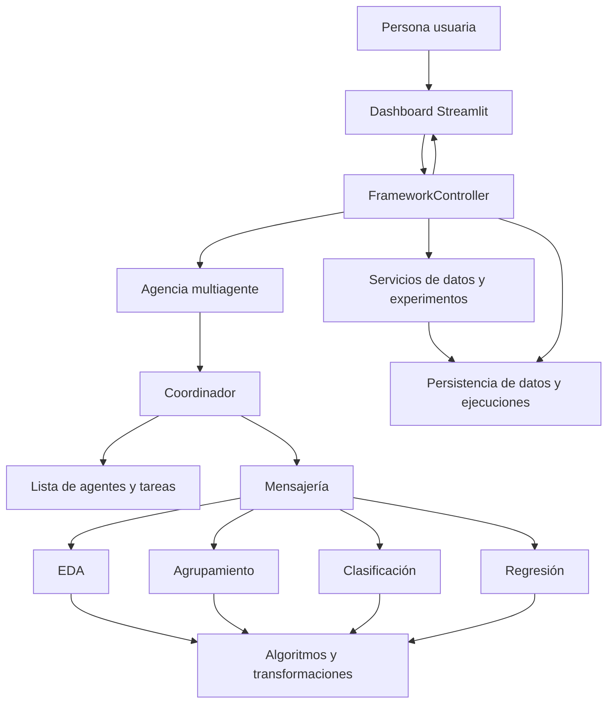
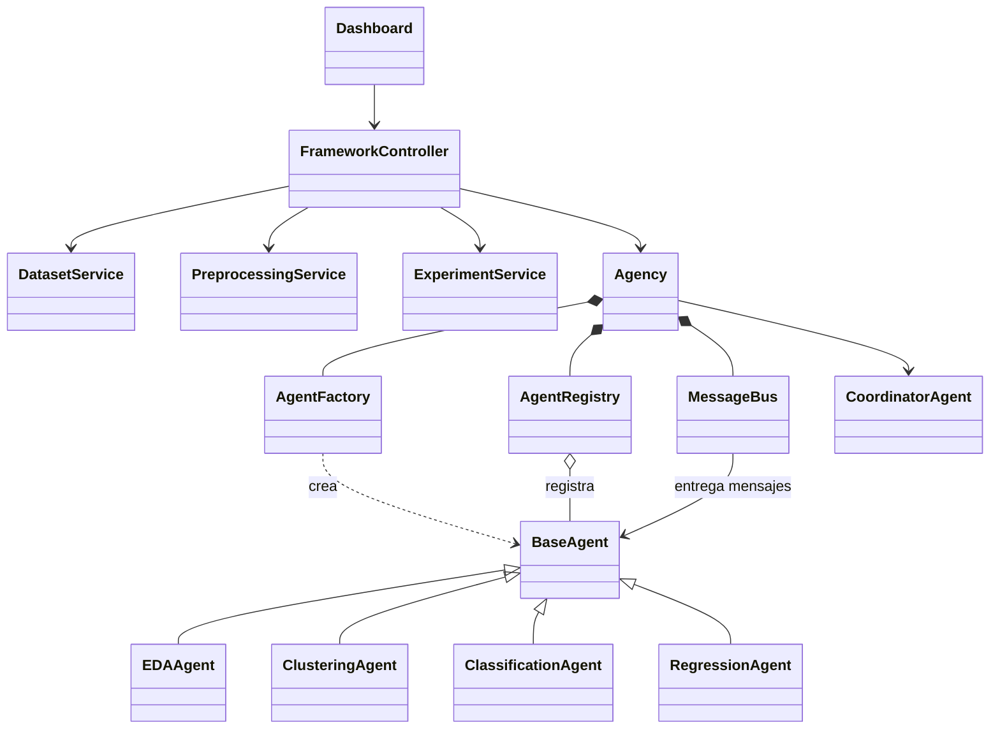
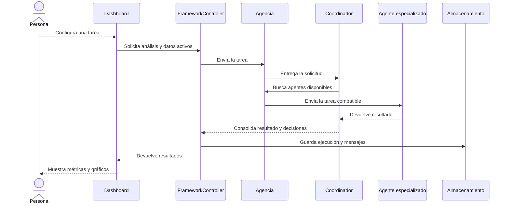

# Diagramas del framework

## Arquitectura por capas

```mermaid
flowchart TB
    U[Persona usuaria] --> UI[Dashboard Streamlit]
    UI --> C[FrameworkController]
    C --> S[Servicios de datos y experimentos]
    C --> A[Agencia multiagente]
    A --> CO[Coordinador]
    CO --> R[Lista de agentes y tareas]
    CO --> B[Mensajería]
    B --> E[EDA]
    B --> CL[Agrupamiento]
    B --> CS[Clasificación]
    B --> RG[Regresión]
    E --> ML[Algoritmos y transformaciones]
    CL --> ML
    CS --> ML
    RG --> ML
    S --> P[Persistencia de datos y ejecuciones]
    C --> P
    C --> UI
```

## Componentes principales

```mermaid
classDiagram
    class Dashboard
    class FrameworkController
    class DatasetService
    class PreprocessingService
    class ExperimentService
    class Agency
    class AgentRegistry
    class AgentFactory
    class MessageBus
    class CoordinatorAgent
    class BaseAgent
    class EDAAgent
    class ClusteringAgent
    class ClassificationAgent
    class RegressionAgent
    Dashboard --> FrameworkController
    FrameworkController --> DatasetService
    FrameworkController --> PreprocessingService
    FrameworkController --> ExperimentService
    FrameworkController --> Agency
    Agency *-- AgentRegistry
    Agency *-- AgentFactory
    Agency *-- MessageBus
    Agency --> CoordinatorAgent
    BaseAgent <|-- EDAAgent
    BaseAgent <|-- ClusteringAgent
    BaseAgent <|-- ClassificationAgent
    BaseAgent <|-- RegressionAgent
    AgentFactory ..> BaseAgent : crea
    AgentRegistry o-- BaseAgent : registra
    MessageBus --> BaseAgent : entrega mensajes
```

## Secuencia de una tarea de análisis

```mermaid
sequenceDiagram
    actor Persona
    participant UI as Dashboard
    participant Controller as FrameworkController
    participant Agency as Agencia
    participant Coordinator as Coordinador
    participant Agent as Agente especializado
    participant Store as Almacenamiento
    Persona->>UI: Configura una tarea
    UI->>Controller: Solicita análisis y datos activos
    Controller->>Agency: Envía la tarea
    Agency->>Coordinator: Entrega la solicitud
    Coordinator->>Agency: Busca agentes disponibles
    Agency->>Agent: Envía la tarea compatible
    Agent-->>Coordinator: Devuelve resultado
    Coordinator-->>Controller: Consolida resultado y decisiones
    Controller->>Store: Guarda ejecución y mensajes
    Controller-->>UI: Devuelve resultados
    UI-->>Persona: Muestra métricas y gráficos
```
